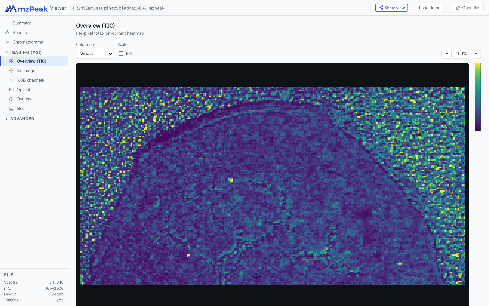

# mzPeakViewer

A fast, browser-based viewer for **[mzPeak](https://github.com/HUPO-PSI/mzPeak)**
mass-spectrometry files — no install, no backend, nothing uploaded anywhere. Open a
file from your computer or stream one straight from a URL, and explore its spectra,
chromatograms, imaging (MSI) ion images, ion-mobility (timsTOF) frames, reporter-ion
channels, metadata, and the underlying Parquet structure. The imaging and ion-mobility
layers activate automatically for the file types that carry them.

**[▶ Open the viewer](https://www.mzpeak.org/view/)**  ·
**[📖 User manual](docs/index.html)**  ·
**[⤓ Desktop apps](https://github.com/okohlbacher/mzpeakviewer/releases/latest)**  ·
**[🔬 Example datasets](https://www.mzpeak.org/examples)**



## What it does

- **Open anything mzPeak** — drag-and-drop a `.mzpeak` file, browse for one, or paste a
  remote URL. Remote files are read with HTTP range requests, so only the bytes actually
  needed are fetched — even multi-gigabyte files open in seconds.
- **Overview** — a file summary: spectra count, m/z range, MS levels (with each level's
  profile/centroid mode), instrument, a capability read-out, and a **Study** panel for SDRF
  datasets (dataset accession, isobaric channels, a sample characteristics matrix, and the
  full embedded SDRF table).
- **Spectra** — interactive m/z–intensity plots with zoom, an MS-level filter, navigation by
  **native scan number**, a profile/centroid type label, reporter-ion (TMT/iTRAQ) highlighting,
  a **peak table** for centroid spectra, a full **per-spectrum metadata** panel,
  **click-a-peak → ion image**, and **right-click-a-peak → extracted-ion chromatogram** (limited
  to the spectrum's MS level).
- **Imaging (MSI)** — per-pixel TIC heatmaps, single-ion images, RGB composites, embedded
  optical microscopy, and optical/ion overlays; plus TIC normalization, Gaussian smoothing,
  histogram contrast, a whole-image **mean spectrum**, **ROI → mean spectrum** (drag a
  rectangle), and **TIFF export**. Click any pixel to inspect its spectrum.
- **Chromatograms** — a managed list of chromatogram cards, each independently zoomable
  (drag-select a region, wheel-zoom, double-click to reset) and resizable. List the file's
  **stored chromatograms** with full metadata (type, polarity, SRM/MRM precursor→product, CV
  detail) and add any to a card, or generate in-memory **total-ion** and **extracted-ion** (XIC,
  m/z ± tolerance over an optional retention-time window) traces. Click a card to jump to the
  nearest spectrum.
- **UV/VIS (PDA / DAD)** — for files with wavelength spectra, a dedicated view with a per-time
  absorbance **spectrum**, a derived **chromatogram** (max-absorbance trace or a single extracted
  wavelength), and a 2-D time × wavelength **heatmap**. Click the heatmap or chromatogram to jump
  to the spectrum at that retention time.
- **Ion mobility (IMS / timsTOF)** — for files that carry per-peak ion mobility, a dedicated view
  that renders each frame as a 2-D **m/z × 1/K₀ heatmap** (viridis, log-intensity), with a frame
  stepper to browse the run. The tab appears automatically for ion-mobility files; the same frame
  heatmap is also shown inline beneath the 1-D plot in the Spectra view.
- **Structure** — deep Parquet inspection: archive members, per-column footers,
  encodings, row-group layout, page-index status, and on-demand value distributions.
- **Deep links, sharing & USI** — every view is a shareable URL (file, spectrum, scan, pixel,
  ROI, ion image, RGB channels, chromatogram), with an optional live address-bar sync. **Copy
  USI** emits a PSI Universal Spectrum Identifier for the current spectrum. A **Settings** gear
  stores your default XIC m/z tolerance and retention-time window in the browser; an **About**
  button reports the running version/build.

A full walkthrough with screenshots is in the **[user manual](docs/index.html)**.

## Where to use it

| | |
|---|---|
| **Web — no install** | The viewer runs entirely in your browser at **<https://www.mzpeak.org/view/>**. A continuously updated mirror is also published to GitHub Pages on every push to `main`. |
| **Desktop apps** | Native **Windows / macOS / Linux** builds — same app, with native file access for very large local files. Download from **[Releases](https://github.com/okohlbacher/mzpeakviewer/releases/latest)**: `.dmg` (macOS, universal), `.msi` / `.exe` (Windows), `.AppImage` / `.deb` / `.rpm` (Linux). |
| **Examples** | Browse curated example datasets at **<https://www.mzpeak.org/examples>**, or use the three built-in demos on the start page (general LC-MS, MSI imaging, and a TMT experiment). |

## Quick start (web)

1. Open **<https://www.mzpeak.org/view/>**.
2. Drag a `.mzpeak` file onto the page, paste a file URL into the box, or click one of the
   demo datasets (**Open from cloud** streams it; **Download & open** saves it first).
3. Navigate with the left sidebar. The imaging tabs appear automatically for MSI files.
4. Click **Share view** to copy a deep link to whatever you're looking at.

## About the format

mzPeak is an open mass-spectrometry container: an uncompressed ZIP of
[Apache Parquet](https://parquet.apache.org/) tables plus a JSON index
(`mzpeak_index.json`). Specification: <https://github.com/HUPO-PSI/mzPeak>.
mzPeakViewer reads it directly in the browser — no conversion, no server.

## Building from source

Requires Node 20+ and (for the desktop apps) a Rust toolchain. The repository is an npm
workspace and the file reader is a git submodule, so clone recursively.

```bash
git clone --recursive https://github.com/okohlbacher/mzpeakviewer
cd mzpeakviewer
npm run bootstrap                          # init submodule, build the reader, install
npm --workspace @mzpeak/app run dev        # run the web app locally (Vite)
npm --workspace @mzpeak/app run build      # production build → app/dist (static)
```

Desktop apps are built with [Tauri](https://tauri.app/); see **[DESKTOP.md](DESKTOP.md)**
for local builds and the release / signing process.
